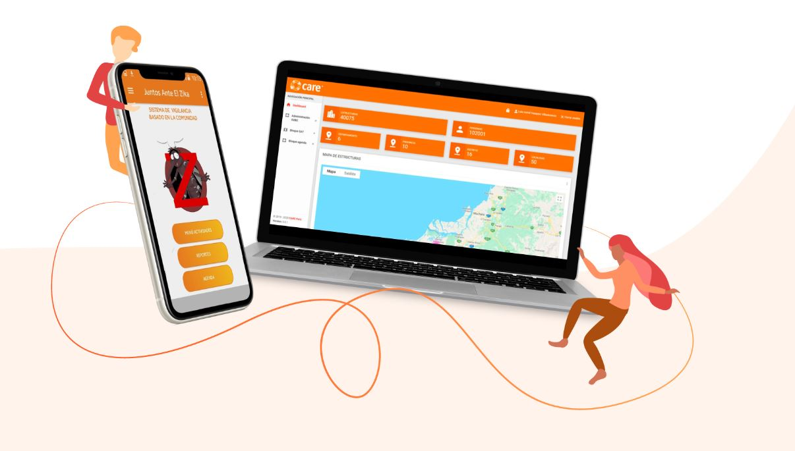
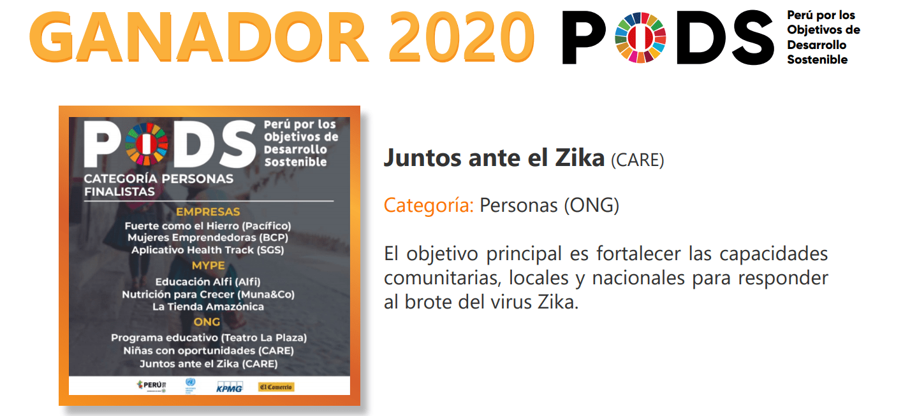
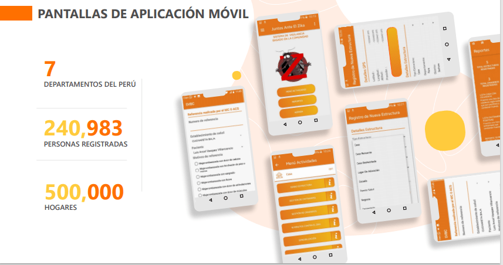
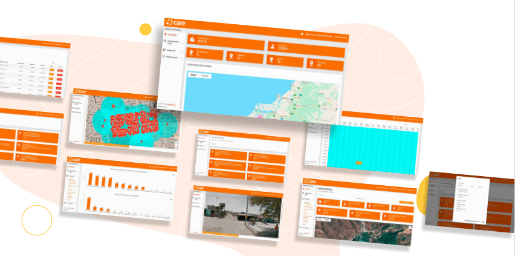
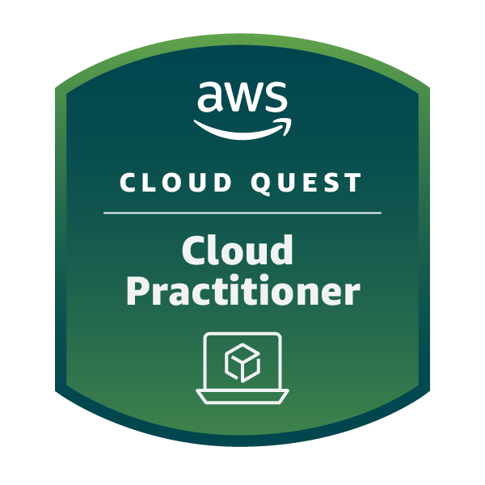
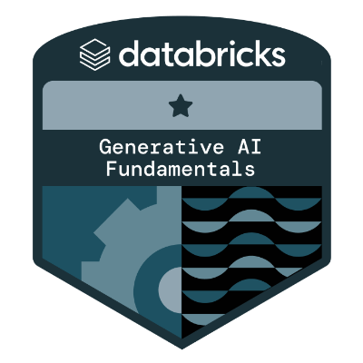
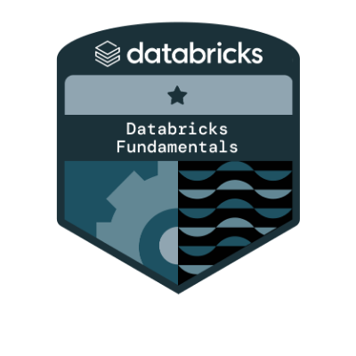

<h1 align="left">Hola 👋, soy Luis Ancel Vasquez Villavicencio</h1>

<h3 align="left">
Soy un arquitecto de soluciones y aplicaciones con vasta experiencia en el desarrollo de software. Poseo un profundo dominio de diversos lenguajes de programación y tecnologías de vanguardia, lo que me capacita para diseñar y construir soluciones innovadoras y escalables. Con una sólida comprensión de los principios y prácticas del desarrollo de software, implemento metodologías ágiles y enfoques de ingeniería tanto en entornos on-premise como en la nube. 
</h3>

<h2>🛠 Experiencia Profesional</h2>

  <h3>App & Cloud Architect and Technical Leader</h3>
  

    <strong>Empresa:</strong> Bonus 
    <strong>Caso:</strong> Creación de plataforma e-commerce Bonus (Web y Apps) 
    <strong>URL:</strong> <a href="https://bonus.pe" target="_blank">bonus.pe</a> 
    <strong>Fecha:</strong> Mayo 2022 - Enero 2025
  

  <ul>
    <li>Definí la arquitectura cloud en AWS utilizando lambdas y microservicios para la plataforma Web, App iOS, y App Android, incluyendo Cloudflare para mejorar la seguridad y el rendimiento.</li>
    <li>Actué como líder técnico, encargándome de la definición de la arquitectura y la construcción del frontend en React.</li>
    <li>Desarrollé la aplicación iOS utilizando SwiftUI, asegurando una experiencia de usuario fluida y eficiente.</li>
    <li>Implementé integraciones con servicios de pago como Izipay, verificación biométrica facial con Keynua, y billeteras digitales para mejorar la experiencia del usuario.</li>
    <li>Definí la base de datos de la aplicación, optimizando el almacenamiento y acceso a los datos.</li>
  </ul>

  <h3>App & Cloud Architect and Technical Leader</h3>
  

    <strong>Empresa:</strong> MinedWord LMS 
    <strong>Caso:</strong> Desarrollo de plataforma de educación online 
    <strong>URL:</strong> <a href="https://minedacademy.com" target="_blank">minedacademy.com</a> 
    <strong>Fecha:</strong> 2023 - Diciembre 2024
  

  <ul>
    <li>Definí una arquitectura serverless en AWS utilizando microservicios con lambdas y API Gateway, integrando un frontend robusto en React para una experiencia de usuario dinámica y eficiente, con Cloudflare para mejorar la seguridad y el rendimiento.</li>
    <li>Actué como líder técnico, encargándome de la definición de la arquitectura y la construcción del frontend.</li>
    <li>Implementé integraciones con servicios de streaming y Nexen para logueo y consulta de pagos.</li>
    <li>Utilicé servicios como Cognito para la integración de login y registros, asegurando una experiencia de usuario fluida y segura.</li>
    <li>Me encargué de la definición de la base de datos de la aplicación en PostgreSQL, optimizando el almacenamiento y acceso a los datos.</li>
  </ul>

  <h3>App Architect & Developer</h3>
  

    <strong>Empresa:</strong> Expodeco 
    <strong>Año:</strong> 2020 
    <strong>Video:</strong> <a href="https://www.youtube.com/watch?v=f-mcCRlpv4g&ab_channel=EXPODECO" target="_blank">Ver Video</a>
  

  <ul>
    <li>Implementé y di soporte a la arquitectura en AWS, incluyendo la creación y configuración de servidores, autoscaling y load balancing con Cloudflare.</li>
    <li>Desarrollé una aplicación web para recorridos 3D, integrando analítica avanzada mediante enlaces para capturar datos de usuario.</li>
    <li>Diseñé y gestioné la base de datos, asegurando un almacenamiento eficiente y seguro de la información.</li>
    <li>Creé un administrador en Laravel para gestionar el contenido de los recorridos 3D y eventos en vivo, con integraciones a Zoom y Google Meet.</li>
    <li>Utilicé Power BI para desarrollar reportes detallados basados en los datos de la base de datos.</li>
    <li>Proporcioné soporte durante el lanzamiento de la aplicación, asegurando un despliegue exitoso.</li>
  </ul>

  <h3>App Developer & Web Architect</h3>
  

    <strong>Empresa:</strong> CARE Perú 
    <strong>Año:</strong> 2019 
    <strong>Premio:</strong> <a href="https://care.org.pe/pods-2020-juntos-ante-el-zika/" target="_blank">PODS 2020: Proyecto "Juntos ante el Zika"</a>
  

  <ul>
    <li>Desarrollé una aplicación Android para censos epidemiológicos del Zika, utilizando tecnología de escaneo de códigos QR para registrar ubicaciones de viviendas con precisión geoespacial.</li>
    <li>Implementé un sistema de almacenamiento local con SQLite para operación offline del aplicativo, con sincronización automática a una base de datos MySQL Aurora en AWS al restablecer la conectividad.</li>
    <li>Diseñé e implementé una API RESTful en Laravel, complementada con un sistema de gestión de contenido que incluía un mapa interactivo para la visualización de datos epidemiológicos y gestion de usuarios.</li>
    <li>El sistema de gestión permitía la exportación de datos en formato Excel y generaba informes analíticos detallados sobre la distribución y prevalencia del virus.</li>
    <li>La infraestructura del proyecto se basó en instancias EC2 y RDS en AWS, optimizando la escalabilidad y el rendimiento del sistema.</li>
  </ul>
  
  

    
    
    
    
  

<h2>🔧 Technical Skills</h2>
<ul>
  <li><strong>Frontend Development:</strong> React, TypeScript, Tailwind CSS, Bootstrap, Material-UI, HTML, CSS, JavaScript</li>
  <li><strong>Cloud Services:</strong> AWS (Avanzado), Azure (Intermedio), Google Cloud (Intermedio)</li>
  <li><strong>Mobile Development:</strong> Android , iOS </li>
  <li><strong>Backend Technologies:</strong> Node.js , Laravel, Python </li>
  <li><strong>Database Systems:</strong> MySQL , PostgreSQL , SQLite , MongoDB , DynamoDB </li>
  <li><strong>API Design and Development:</strong> RESTful APIs </li>
  <li><strong>DevOps and CI/CD:</strong> Docker , Terraform , GitHub Actions </li>
  <li><strong>Data Analysis Tools:</strong> Power BI , Excel </li>
  <li><strong>Version Control:</strong> Git </li>
  <li><strong>Security Practices:</strong> OWASP , Cloudflare , Sonarcloud </li>
  <li><strong>Rapid Development Tools:</strong> Firebase , Supabase </li>
  <li><strong>Analytics and Monitoring:</strong> Google Analytics, Google Sheets</li>
  <li><strong>Service Integration:</strong> Izipay, Keynua, Zoom, Google Meet, Power BI Embedded</li>
</ul>

<h2>🌟 Habilidades Blandas</h2> 
<ul>
  <li><strong>Liderazgo:</strong> Capacidad para liderar equipos técnicos y dirigir proyectos desde la concepción hasta la implementación.</li>
  <li><strong>Comunicación:</strong> Habilidad para comunicar conceptos técnicos a audiencias no técnicas de manera clara y efectiva.</li>
  <li><strong>Colaboración:</strong> Experiencia trabajando en equipos multidisciplinarios y colaborando con diferentes departamentos.</li>
  <li><strong>Gestión del Tiempo:</strong> Capacidad para gestionar múltiples proyectos y cumplir con plazos ajustados.</li>
  <li><strong>Resolución de Problemas:</strong> Habilidad para identificar problemas complejos y desarrollar soluciones innovadoras.</li>
  <li><strong>Adaptabilidad:</strong> Flexibilidad para adaptarse a nuevas tecnologías y metodologías de trabajo.</li>
  <li><strong>Orientación al Cliente:</strong> Enfoque en mejorar la experiencia del usuario y satisfacer las necesidades del cliente.</li>
</ul>

<h2>🏢 Chief Technology Officer (CTO) Experience</h2>
<ul>
  <li><strong>Ubicabien:</strong> 
    <strong>URL:</strong> <a href="https://www.ubicabien.com/" target="_blank">ubicabien.com</a> 
    <strong>Año:</strong> 2025 
    Como CTO, soy responsable de toda la parte tecnológica, incluyendo la creación de la plataforma y la implementación de lógicas complejas. Trabajamos con mapas y zonas de riesgo, utilizando tecnologías como AWS, Vercel, Firebase, y APIs de Google Maps, así como datos propios para evaluar la viabilidad de inversiones en terrenos.
  </li>
  <li><strong>Sangre Fuerte:</strong> 
    <strong>URL:</strong> <a href="https://www.sangrefuerte.com/" target="_blank">sangrefuerte.com</a> 
    <strong>Año:</strong> 2025 
    En esta healthtech, lidero el desarrollo tecnológico para identificar anemia mediante fotos del párpado y uñas. Desarrollé la aplicación usando Ionic como tecnología híbrida, integrando un modelo de predicción y utilizando Supabase para el almacenamiento de datos, además de AWS. Soy responsable de toda la parte tecnológica.
  </li>
</ul>

<h2>📂 Mis Proyectos</h2>
<ul>
  <li><strong>Portal Mi Canva:</strong> Plataforma para la creación de sitios web. <a href="https://portalmicanva.com/" target="_blank">portalmicanva.com</a></li>
</ul>

<h2>🏆 Logros y Certificaciones</h2>

<h3 align="left">Connect with me:</h3>

<h3 align="left">Languages and Tools:</h3>

                                            

&nbsp;

https://www.notion.com/es

  

  

Proyecto MinedTV LMS en Streaming
Proyecto Portal Micanva
Proyecto Escáner Harmonix
Proyecto Aplicación Crypton App/iOS Nativo
Proyecto Web Easyfy Template para Shopify
Proyecto Aplicación BinaryBeats App/iOS Nativo
Proyecto MinedAcademy LMS
Proyecto MinedEbook
Proyecto CashKing
Proyecto Aplicación MinedGo App/iOS Nativo
Proyecto MiVisualización
Proyecto Feria Online Expodeco
Proyecto MiConect
Proyecto CIP Colegio de Ingenieros Generación de Certificados de Habilidades
Proyecto Aplicación Prospera App LMS Offline
Proyecto Gestión del Proceso de Café
div>
  <h3>💼 Proyecto: MinedTV LMS en Streaming</h3>

  <h3>💼 Proyecto: Escáner Harmonix</h3>

  <h3>💼 Proyecto: Aplicación Crypton App/iOS Nativo</h3>

  <h3>💼 Proyecto: Web Easyfy Template para Shopify</h3>

  <h3>💼 Proyecto: Aplicación BinaryBeats App/iOS Nativo</h3>

  <h3>💼 Proyecto: MinedAcademy LMS</h3>

  <h3>💼 Proyecto: MinedEbook</h3>

  <h3>💼 Proyecto: CashKing</h3>

  <h3>💼 Proyecto: Aplicación MinedGo App/iOS Nativo</h3>

  <h3>💼 Proyecto: MiVisualización</h3>

  <h3>💼 Proyecto: MiConect</h3> envios masivos wsp

  <h3>💼 Proyecto: CIP Colegio de Ingenieros Generación de Certificados de Habilidades</
  <h3>💼 Proyecto: Aplicación Prospera App LMS Offline</h3>

    
 EL APP QUE ESRA CURSSO OFFLINE
  

minedgo
https://apps.apple.com/ec/app/mined-go/id1611429257
https://mined.world/mined-go-la-herramienta-mas-potente-de-la-industria-del-trading/

colegio inge º

https://millev.com/portfolio/sistema-de-emision-certificado-de-habilidad/

beneficiarios 

https://millev.com/portfolio/sistema-de-gestion-de-beneficiarios/

linkd e mined
https://mined.world/

